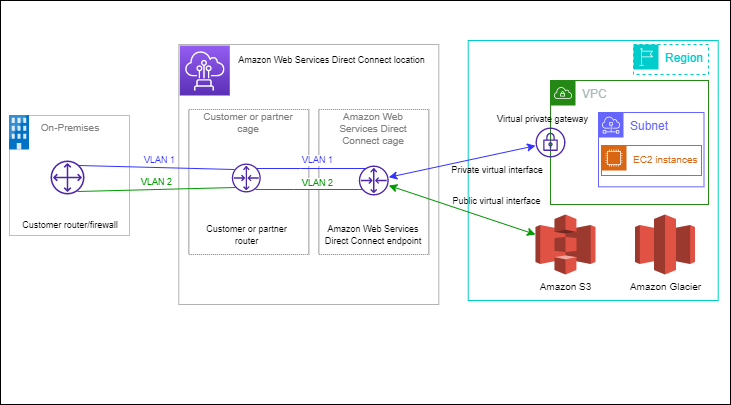

## AWS Direct Connect

AWS Direct Connect links your internal network to an AWS Direct Connect location over a standard Ethernet fiber-optic cable. One end of the cable is connected to your router, the other to an AWS Direct Connect router. With this connection, you can create *virtual interfaces* directly to public AWS services (for example, to Amazon S3) or to Amazon VPC, bypassing internet service providers in your network path. An AWS Direct Connect location provides access to AWS in the Region with which it is associated. You can use a single connection in a public Region or AWS GovCloud (US) to access public AWS services in all other public Regions.

1. [Site-to-Site VPN vs Direct Connect vs Remote VPN](https://www.thewindowsclub.com/site-to-site-vpn-vs-direct-connect-vs-remote-vpn)