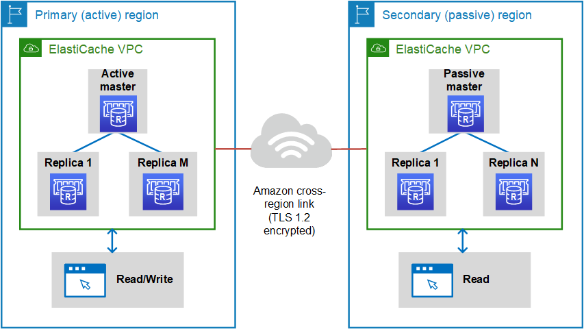
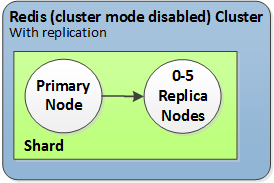
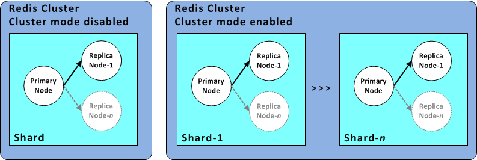

# Amazon ElastiCache

Amazon ElastiCache makes it easy to set up, manage, and scale distributed in-memory cache environments in the AWS Cloud. It provides a high performance, resizable, and cost-effective in-memory cache, while removing complexity associated with deploying and managing a distributed cache environment. ElastiCache works with both the Redis and Memcached engines.

## Amazon ElastiCache for Redis

### Comparing Memcached and Redis

On the surface, the engines look similar. Each of them is an in-memory key-value store. However, in practice there are significant differences.

Choose Memcached if the following apply for you:

- You need the simplest model possible.
- You need to run large nodes with multiple cores or threads.
- You need the ability to scale out and in, adding and removing nodes as demand on your system increases and decreases.
- You need to cache objects.

### Replication across AWS Regions using global datastores

By using the Global Datastore for Redis feature, you can work with fully managed, fast, reliable, and secure replication across AWS Regions. Using this feature, you can create cross-Region read replica clusters for ElastiCache for Redis to enable low-latency reads and disaster recovery across AWS Regions.

A global datastore consists of the following:

- Primary (active) cluster
- Secondary (passive) cluster

### High availability using replication groups

- Redis (Cluster Mode Disabled)

    A Redis (cluster mode disabled) cluster has a single shard, inside of which is a collection of Redis nodes; one primary read/write node and up to five secondary, read-only replica nodes.

    

- Redis (cluster mode enabled)

    A Redis (cluster mode enabled) cluster is comprised of from 1 to 500 shards (API/CLI: node groups). Each shard has a primary node and up to five read-only replica nodes. The configuration can range from 90 shards and 0 replicas to 15 shards and 5 replicas, which is the maximum number of replicas allowed.

    

## Amazon ElastiCache for Memcached

## References

1. [What Is Amazon ElastiCache? A Beginner-Friendly Guide](https://www.cloudzero.com/blog/amazon-elasticache)