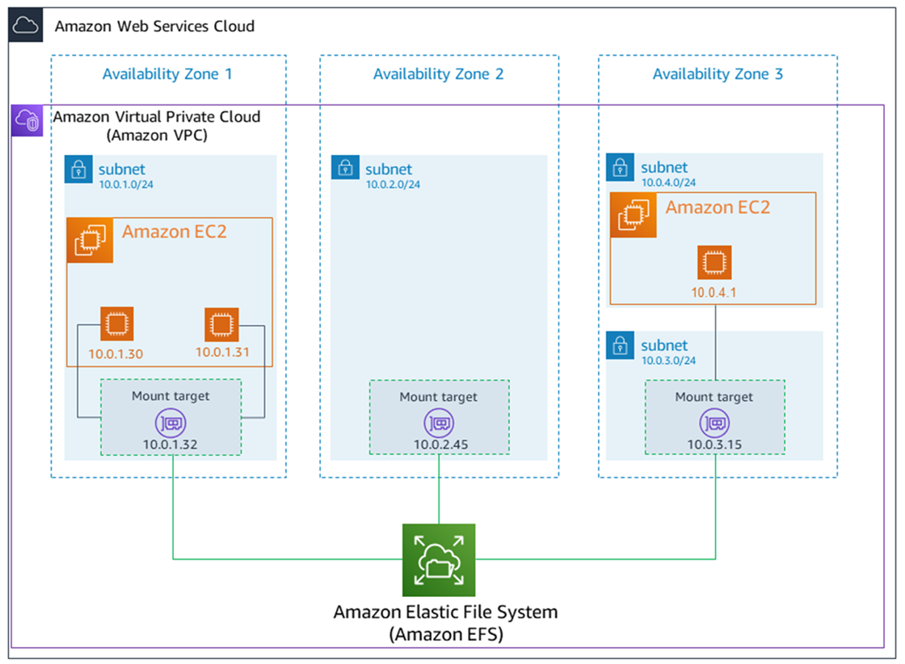
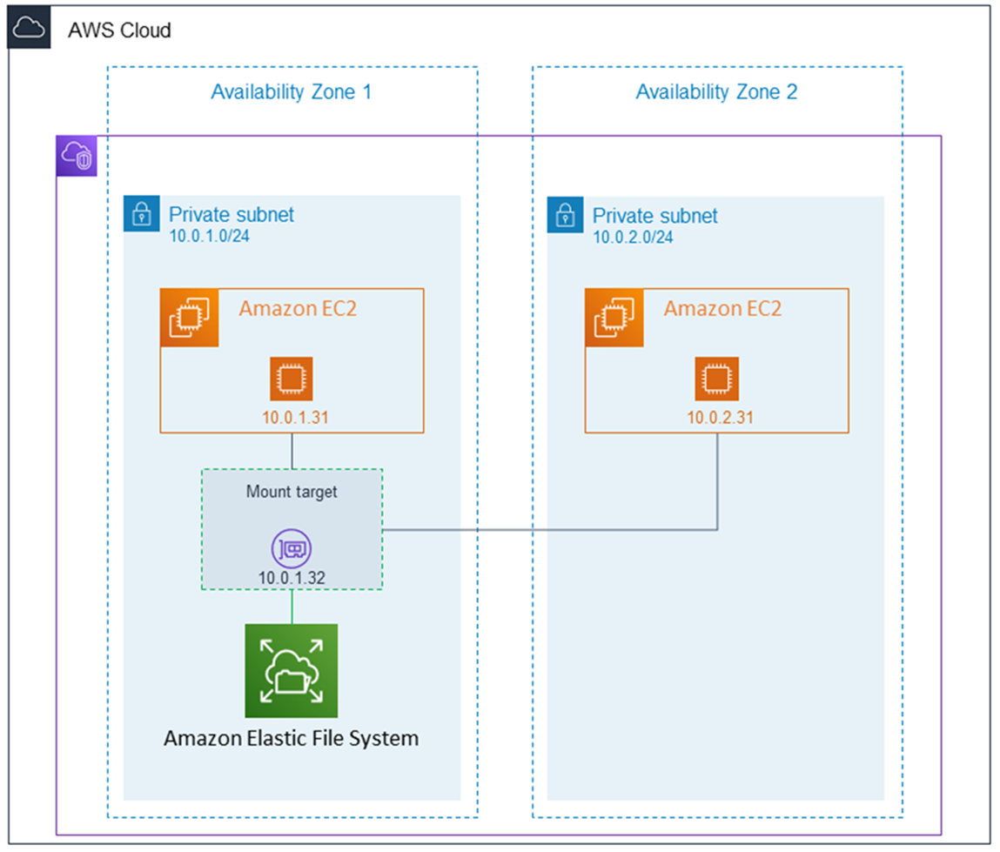
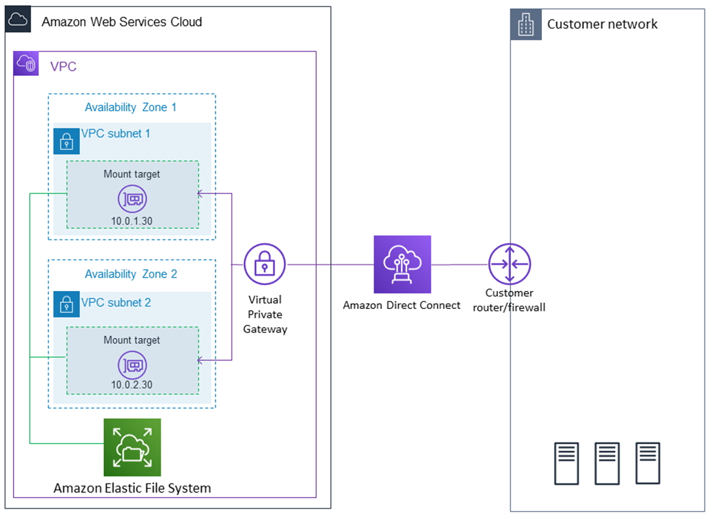

## Amazon Elastic File System

Amazon Elastic File System (Amazon EFS) provides serverless, fully elastic file storage so that you can share file data without provisioning or managing storage capacity and performance. Amazon EFS is built to scale on demand to petabytes without disrupting applications, growing and shrinking automatically as you add and remove files. Because Amazon EFS has a simple web services interface, you can create and configure file systems quickly and easily. The service manages all the file storage infrastructure for you, meaning that you can avoid the complexity of deploying, patching, and maintaining complex file system configurations.

Amazon EFS supports the Network File System version 4 (NFSv4.1 and NFSv4.0) protocol, so the applications and tools that you use today work seamlessly with Amazon EFS. Multiple compute instances, including Amazon EC2, Amazon ECS, and AWS Lambda, can access an Amazon EFS file system at the same time. Therefore, an EFS file system can provide a common data source for workloads and applications that are running on more than one compute instance or server.

With Amazon EFS, you pay only for the storage used by your file system and there is no minimum fee or setup cost. Amazon EFS offers the following storage class options for different use cases:

- **Standard storage classes** (Recommended) – EFS Standard and EFS Standard–Infrequent Access (Standard–IA), which offer Multi-AZ resilience and the highest levels of durability and availability.

- **One Zone storage classes** – EFS One Zone and EFS One Zone–Infrequent Access (EFS One Zone–IA), which offer you the choice of additional savings by choosing to save your data in a single Availability Zone.

Performance and throughput modes:

- General Purpose performance mode
- Elastic Throughput mode
- Max I/O performance mode
- Provisioned Throughput mode
- Bursting Throughput mode

## Amazon EFS with Standard storage classes

## Amazon EFS with One Zone storage classes

## How Amazon EFS works with AWS Direct Connect and AWS Managed VPN

