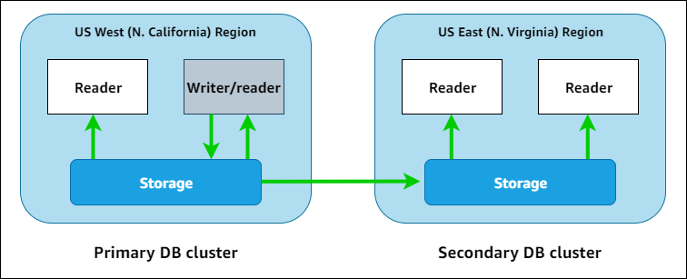

# Amazon RDS

Amazon Relational Database Service (Amazon RDS) is a web service that makes it easier to set up, operate, and scale a relational database in the AWS Cloud. It provides cost-efficient, resizable capacity for an industry-standard relational database and manages common database administration tasks.

## DB instances

A *DB instance* is an isolated database environment in the AWS Cloud. The basic building block of Amazon RDS is the DB instance.

Your DB instance can contain one or more user-created databases. You can access your DB instance by using the same tools and applications that you use with a standalone database instance.

## DB engines

A *DB engine* is the specific relational database software that runs on your DB instance. Amazon RDS currently supports the following engines:

- MariaDB
- Microsoft SQL Server
- MySQL
- Oracle
- PostgreSQL

## DB instance classes

A *DB instance* class determines the computation and memory capacity of a DB instance. A DB instance class consists of both the DB instance type and the size. Each instance type offers different compute, memory, and storage capabilities.

## DB instance read replicas

A *read replica* is a read-only copy of a DB instance. You can reduce the load on your primary DB instance by routing queries from your applications to the read replica. When you make updates to the primary DB instance, Amazon RDS copies them **asynchronously** to the read replica.

## Multi-AZ deployment

Multi-AZ deployments can have one standby or two standby DB instances.

When the deployment has one standby DB instance, it's called a *Multi-AZ DB instance deployment*. A Multi-AZ DB instance deployment has one standby DB instance that provides failover support, but doesn't serve read traffic. In a Multi-AZ DB instance deployment, Amazon RDS automatically provisions and maintains a **synchronous** standby replica in a different Availability Zone.

When the deployment has two standby DB instances, it's called a *Multi-AZ DB cluster deployment*. A Multi-AZ DB cluster deployment has standby DB instances that provide failover support and can also serve read traffic. A Multi-AZ DB cluster deployment is a **semisynchronous**, high availability deployment mode of Amazon RDS with two readable standby DB instances.

# Amazon Aurora

Amazon Aurora (Aurora) is a fully managed relational database engine that's compatible with MySQL and PostgreSQL. You already know how MySQL and PostgreSQL combine the speed and reliability of high-end commercial databases with the simplicity and cost-effectiveness of open-source databases. The code, tools, and applications you use today with your existing MySQL and PostgreSQL databases can be used with Aurora. With some workloads, Aurora can deliver up to five times the throughput of MySQL and up to three times the throughput of PostgreSQL without requiring changes to most of your existing applications.

Aurora includes a high-performance storage subsystem. Its MySQL- and PostgreSQL-compatible database engines are customized to take advantage of that fast distributed storage. The underlying storage grows automatically as needed. An Aurora cluster volume can grow to a maximum size of 128 tebibytes (TiB). Aurora also automates and standardizes database clustering and replication, which are typically among the most challenging aspects of database configuration and administration.

Aurora is part of the managed database service Amazon Relational Database Service (Amazon RDS). Amazon RDS is a web service that makes it easier to set up, operate, and scale a relational database in the cloud.

## Amazon Aurora DB clusters

An Amazon Aurora DB cluster consists of one or more DB instances and a cluster volume that manages the data for those DB instances. An Aurora *cluster volume* is a virtual database storage volume that spans multiple Availability Zones, with each Availability Zone having a copy of the DB cluster data. Two types of DB instances make up an Aurora DB cluster:

- **Primary DB instance** – Supports read and write operations, and performs all of the data modifications to the cluster volume. Each Aurora DB cluster has one primary DB instance.

- **Aurora Replica** – Connects to the same storage volume as the primary DB instance and supports only read operations. Each Aurora DB cluster can have up to 15 Aurora Replicas in addition to the primary DB instance. Maintain high availability by locating Aurora Replicas in separate Availability Zones. Aurora automatically fails over to an Aurora Replica in case the primary DB instance becomes unavailable. You can specify the failover priority for Aurora Replicas. Aurora Replicas can also offload read workloads from the primary DB instance.

The following diagram illustrates the relationship between the cluster volume, the primary DB instance, and Aurora Replicas in an Aurora DB cluster.

The Aurora cluster illustrates the separation of compute capacity and storage. For example, an Aurora configuration with only a single DB instance is still a cluster, because the underlying storage volume involves multiple storage nodes distributed across multiple Availability Zones (AZs).

## Amazon Aurora versions

Each Amazon Aurora version is compatible with a specific community database version of either MySQL or PostgreSQL.

## Regions and Availability Zones

When you view your resources, you see only the resources that are tied to the AWS Region that you specified. This is because AWS Regions are isolated from each other, and we don't automatically replicate resources across AWS Regions.

## Supported features in Amazon Aurora by AWS Region and Aurora DB engine

- Blue/Green Deployments
- Aurora cluster storage configurations
    - Aurora I/O-Optimized
    - Aurora Standard
- Database activity streams in Aurora
- Exporting cluster data to Amazon S3
- Exporting snapshot data to Amazon S3
- Aurora global databases
- IAM database authentication in Aurora
- Kerberos authentication with Aurora
- Aurora machine learning
- Performance Insights with Aurora
- Zero-ETL integrations with Amazon Redshift
- Amazon RDS Proxy
- Secrets Manager integration
- Aurora Serverless v2
- Aurora Serverless v1
- Data API for Aurora Serverless v1
- Zero-downtime patching (ZDP)
- Engine-native features

## Types of Aurora endpoints

- Cluster endpoint
- Reader endpoint
- Custom endpoint
- Instance endpoint

## Amazon Aurora storage and reliability

A cluster volume consists of copies of the data across three Availability Zones in a single AWS Region. The amount of replication is independent of the number of DB instances in your cluster.

Aurora includes several automatic features that make it a reliable database solution.

- Storage auto-repair
- Survivable page cache
- Crash recovery

## Aurora Replicas

When you create a second, third, and so on DB instance in an Aurora provisioned DB cluster, Aurora automatically sets up replication from the writer DB instance to all the other DB instances. These other DB instances are read-only and are known as Aurora Replicas. We also refer to them as reader instances when discussing the ways that you can combine writer and reader DB instances within a cluster.

Aurora Replicas have two main purposes. You can issue queries to them to scale the read operations for your application. You typically do so by connecting to the reader endpoint of the cluster. That way, Aurora can spread the load for read-only connections across as many Aurora Replicas as you have in the cluster. Aurora Replicas also help to increase availability. If the writer instance in a cluster becomes unavailable, Aurora automatically promotes one of the reader instances to take its place as the new writer.

## Using Amazon Aurora global databases

An Aurora global database consists of one primary AWS Region where your data is written, and up to five read-only secondary AWS Regions. You issue write operations directly to the primary DB cluster in the primary AWS Region. Aurora replicates data to the secondary AWS Regions using dedicated infrastructure, with latency typically under a second.

