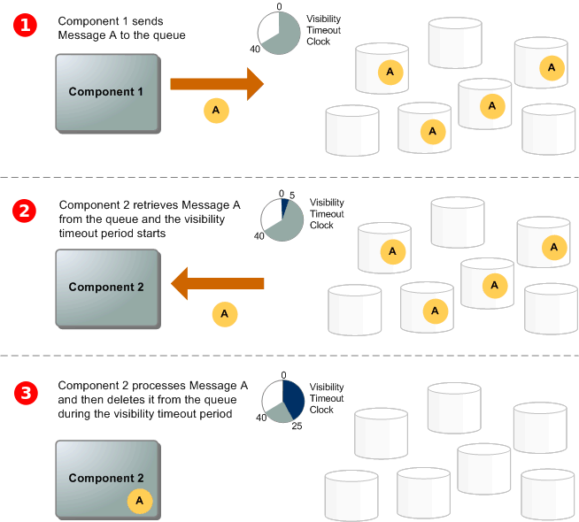

# Amazon Simple Queue Service

Amazon Simple Queue Service (Amazon SQS) offers a secure, durable, and available hosted queue that lets you integrate and decouple distributed software systems and components.

## Basic Amazon SQS architecture

This section outlines the parts of a distributed messaging system and explains the lifecycle of an Amazon SQS message.

### Distributed queues

There are three main parts in a distributed messaging system: the components of your distributed system, your queue (distributed on Amazon SQS servers), and the messages in the queue.

In the following scenario, your system has several *producers* (components that send messages to the queue) and *consumers* (components that receive messages from the queue). The queue (which holds messages A through E) redundantly stores the messages across multiple Amazon SQS servers.

### Message lifecycle

The following scenario describes the lifecycle of an Amazon SQS message in a queue, from creation to deletion.

1. A producer (component 1) sends message A to a queue, and the message is distributed across the Amazon SQS servers redundantly.

2. When a consumer (component 2) is ready to process messages, it consumes messages from the queue, and message A is returned. While message A is being processed, it remains in the queue and isn't returned to subsequent receive requests for the duration of the visibility timeout.

3. The consumer (component 2) deletes message A from the queue to prevent the message from being received and processed again when the visibility timeout expires.

## Amazon SQS queue types

| Standard queues | FIFO queues |
| --- | --- |
| Unlimited Throughput | High Throughput |
| At-Least-Once Delivery | Exactly-Once Processing |
| Best-Effort Ordering | First-In-First-Out Delivery |
