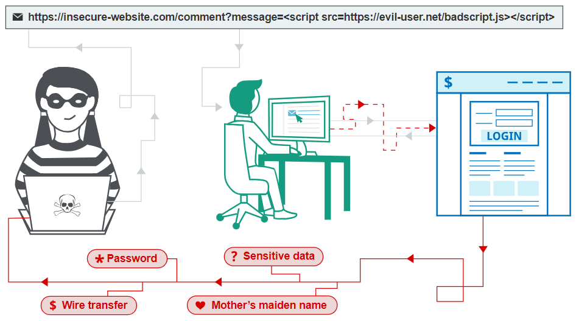

# Cross-site scripting

## What is cross-site scripting (XSS)?

Cross-site scripting (also known as XSS) is a web security vulnerability that allows an attacker to compromise the interactions that users have with a vulnerable application. It allows an attacker to circumvent the same origin policy, which is designed to segregate different websites from each other. Cross-site scripting vulnerabilities normally allow an attacker to masquerade as a victim user, to carry out any actions that the user is able to perform, and to access any of the user's data. If the victim user has privileged access within the application, then the attacker might be able to gain full control over all of the application's functionality and data.

## How does XSS work?

Cross-site scripting works by manipulating a vulnerable web site so that it returns malicious JavaScript to users. When the malicious code executes inside a victim's browser, the attacker can fully compromise their interaction with the application.

## References

1. [Cross-site scripting](https://portswigger.net/web-security/cross-site-scripting)
